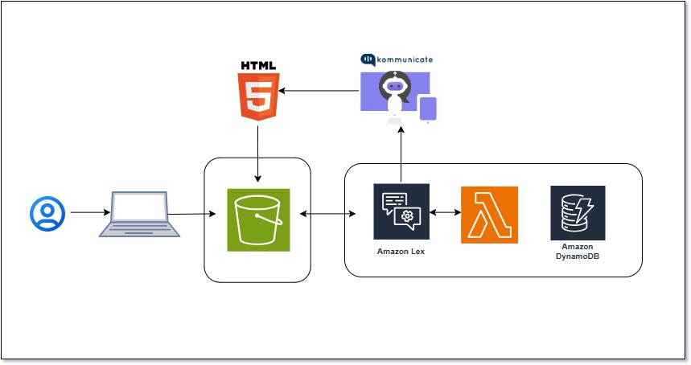

# 🧠 Mental Health Support Chatbot

## Table of Contents
- [Project Overview](#project-overview)
- [Architecture](#architecture)
- [Features](#features)
- [Tech Stack](#tech-stack)
- [Getting Started](#getting-started)
  - [Prerequisites](#prerequisites)
  - [Setup Instructions](#setup-instructions)
- [Usage](#usage)
- [Future Enhancements](#future-enhancements)
- [Contributing](#contributing)
- [License](#license)
- [Acknowledgments](#acknowledgments)

---

## 📘 Project Overview

The **Mental Health Support Chatbot** is a serverless, AI-powered solution designed to provide mental health tips, stress-relief techniques, and instant support. This chatbot is accessible 24/7, scalable, and ensures user anonymity. It leverages AWS services like Amazon Lex, Lambda, and DynamoDB to offer real-time responses to stress and anxiety triggers, empowering users with mental health resources and coping strategies.

## 🏗️ Architecture

The solution uses a serverless architecture that integrates various AWS services to provide seamless interactions. Below is the architectural diagram for the project:



### **Architecture Components**
- **User Interface**: A web-based front-end built using HTML5, CSS, and JavaScript.
- **Amazon Lex**: Powers the chatbot with natural language understanding (NLU) capabilities.
- **AWS Lambda**: Handles the backend logic for processing intents and generating responses.
- **Amazon DynamoDB**: Stores user interaction data for future analysis and personalization.
- **Amazon S3**: Hosts the static website files and chatbot UI.

## ✨ Features
- **Natural Language Understanding**: Processes user input to understand and respond to various mental health-related queries.
- **Serverless & Scalable**: Built using AWS serverless architecture to ensure high scalability and low operational costs.
- **Privacy-Focused**: Ensures user anonymity by not storing personally identifiable information.
- **Real-Time Responses**: Provides instant support and mental health resources.
- **Stress-Relief Techniques**: Offers coping strategies like breathing exercises, positive affirmations, and mindfulness tips.

## 🛠️ Tech Stack
- **Frontend**: HTML5, CSS
- **Cloud Services**: AWS (Amazon Lex, AWS Lambda, Amazon DynamoDB, Amazon S3)
- **APIs**: Kommunicate for chatbot integration

## 🚀 Getting Started

### Prerequisites
- AWS Account
- AWS CLI configured on your local machine
- Node.js and npm installed
- Basic knowledge of AWS services (Lex, Lambda, S3, DynamoDB)

### Setup Instructions

#### Step 1: Clone the Repository
```bash
git clone https://github.com/your-username/mental-health-chatbot.git
cd mental-health-chatbot
