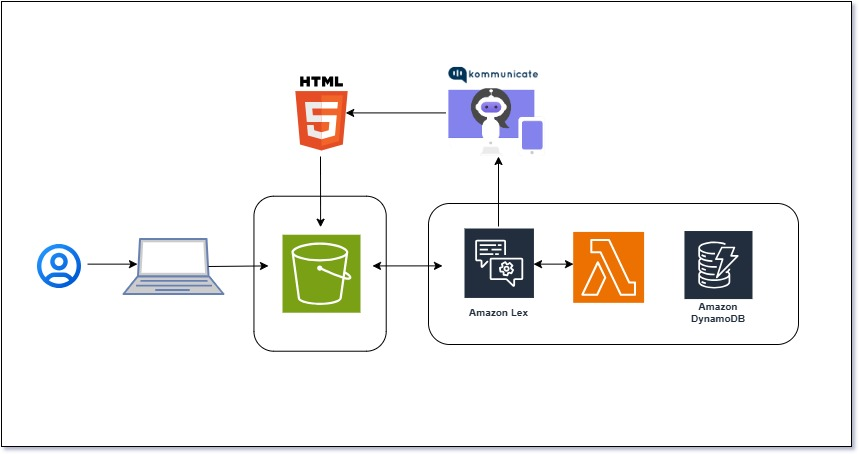
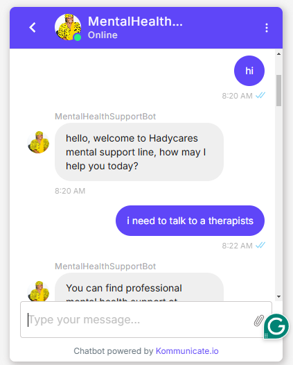
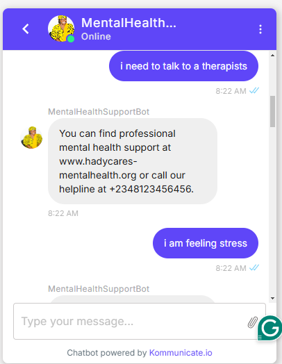
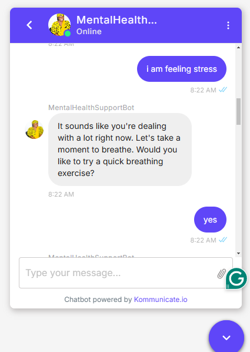
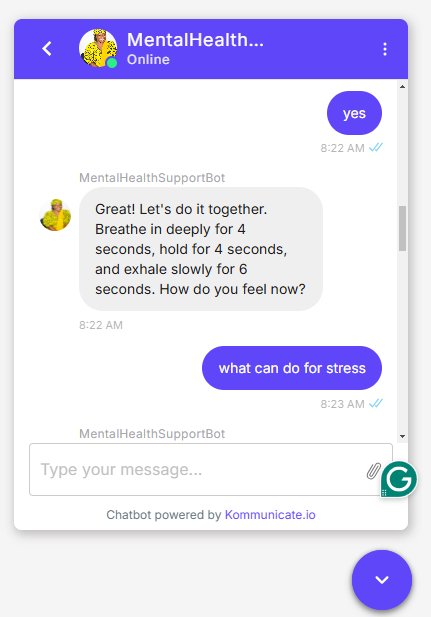
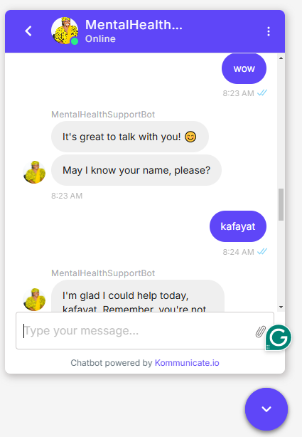
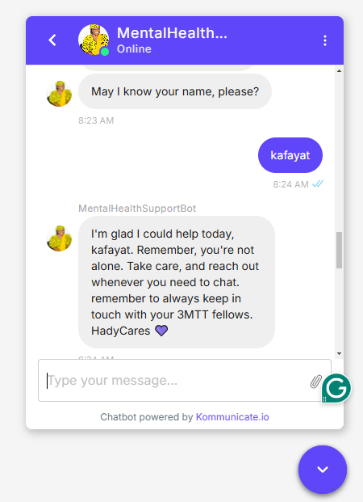

# Mental Health Support Chatbot



## Project Overview

This project is a Serverless Chatbot for Mental Health Support, developed as part of the 3MTT Tech 4 Good Hackathon. The chatbot leverages AWS services like Amazon Lex, AWS Lambda, Amazon S3, and Amazon DynamoDB to provide mental health support and resources. It is designed to be an MVP (Minimum Viable Product) for mental wellness, capable of assisting users with stress, anxiety, and relaxation techniques.

### Hosted Project Link

🔗 [Try the Mental Health Chatbot here](https://hadycares-mental-health-chatbot.s3.us-east-1.amazonaws.com/index.html#chatbot)

## Architecture Overview

The chatbot follows a serverless architecture using the following AWS services:

- **Amazon S3**: Hosts the front-end (HTML, CSS, JavaScript) for the chatbot interface.
- **Amazon Lex**: Provides the natural language understanding for user interactions.
- **AWS Lambda**: Processes user input and handles business logic.
- **Amazon DynamoDB**: Stores user session data and interaction history.
- **Kommunicate**: Integrates Amazon Lex with a user-friendly web interface.

## Features

- **User Greetings**: Friendly responses to user greetings.
- **Therapist Recommendations**: Provides resources for professional mental health support.
- **Stress & Anxiety Relief**: Offers breathing exercises and stress management tips.
- **Conversational Flow**: Natural interactions for users seeking help with mental health concerns.

## Getting Started

### How to Test the Chatbot

You can interact with the chatbot by visiting the hosted project link above. Here's a guide on how to test it using predefined prompts.

#### Testing Flow Prompts

1. **Start a Conversation**:
   - Try: 
     ```
     hi
     hello
     good day
     ```
   - Expected Response: A warm greeting from the bot, asking how it can assist you today.

2. **Seeking Professional Help**:
   - Try: 
     ```
     I need to talk to a therapist
     Can you recommend a counselor?
     Where can I get professional help?
     ```
   - Expected Response: Recommendations for professional therapy services like BetterHelp or Talkspace.

3. **Expressing Stress or Anxiety**:
   - Try:
     ```
     I'm overwhelmed
     I need help with anxiety
     I'm feeling stressed
     ```
   - Expected Response: The bot acknowledges your feelings and offers help, asking if you'd like to try a guided breathing exercise.

4. **Requesting a Breathing Exercise**:
   - Try:
     ```
     Yes, I want to try a breathing exercise
     Help me calm down
     I need to relax
     yes, please
     ```
   - Expected Response: The bot guides you through a simple breathing exercise.

5. **Asking for Stress Management Tips**:
   - Try:
     ```
     What can I do for stress?
     ```
   - Expected Response: The bot provides tips on how to manage stress, including deep breathing, physical activity, and mindfulness practices.

6. **Expressing Gratitude**:
   - Try:
     ```
     Thank you
     thanks for the help
     wow, thank you for the help
     ```
   - Expected Response: The bot responds with appreciation, encouraging you to reach out anytime you need support.

**Screenshots**







## Project Setup (For Developers)

If you want to clone and set up this project locally, follow these steps:

### Prerequisites

- AWS account with access to Amazon S3, Amazon Lex, AWS Lambda, and DynamoDB.
- Node.js and npm installed for local development.

### Installation

1. **Clone the repository**:
   ```bash
   git clone https://github.com/your-username/mental-health-chatbot.git
   cd mental-health-chatbot
   ```

2. **Set up your AWS resources**:
   - Create an Amazon Lex bot with the intents described above.
   - Set up an AWS Lambda function for additional processing (if needed).
   - Create a DynamoDB table for session tracking (optional).
   - Deploy your front-end files to an S3 bucket.

3. **Deploy the Frontend**:
   - Upload your `index.html`, `style.css`, and JavaScript files to your S3 bucket.
   - Ensure the bucket is publicly accessible (adjust bucket policy as needed).

4. **Testing Locally**:
   - Open the `index.html` file in your browser or use a local server tool like `live-server`.

## Technologies Used

- **AWS Services**: Amazon Lex, AWS Lambda, Amazon S3, Amazon DynamoDB
- **Frontend**: HTML, CSS, JavaScript
- **Integration**: Kommunicate for enhanced chatbot UI

## Future Enhancements

- Add support for more mental health topics (e.g., depression, coping strategies).
- Integrate with external APIs for real-time therapist availability.
- Expand language support to reach a broader audience.

## Contributors

- **Emmanuel Macaulay** - Lead Developer & Architect

## License

This project is licensed under the MIT License - see the [LICENSE](LICENSE) file for details.

## Acknowledgments

- Thanks to the 3MTT Tech 4 Good Hackathon organizers for the opportunity to develop this solution.
- Special thanks to the AWS Community for guidance on cloud technologies.
